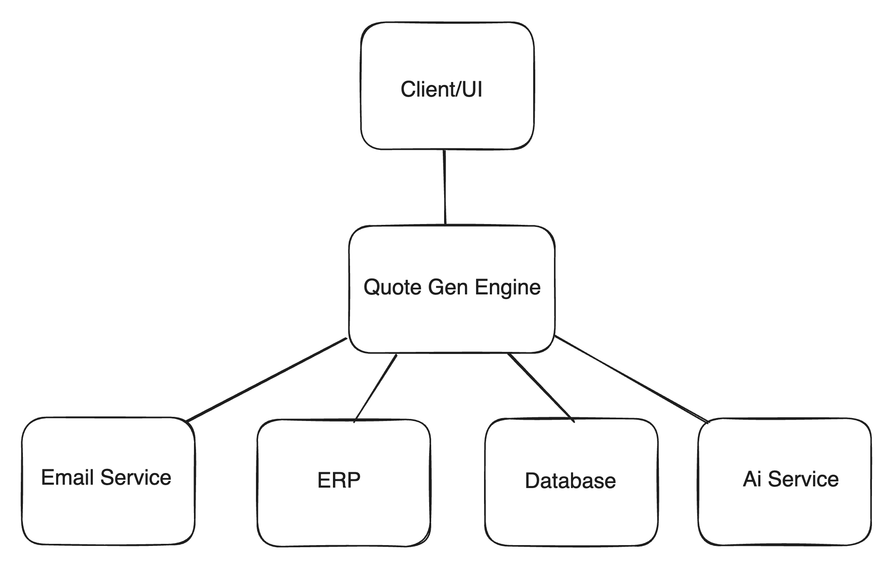

# Quotes Generation Service

- Requirements: https://cloudforge.notion.site/Take-Home-Screen-52af58a7b82e46fa92fe8975101fa539
- Demo: https://drive.google.com/file/d/15_GDeLqlxRnVLSZxKgqi5QvYgDT6jM8N/view?usp=sharing

## Approach

### 1. Understating the problem 
When the test was sent to me a week ago from today (05/31/2024), it didn't have an "Example Data" section. Therefore, I used ChatGPT:
- To remind myself what Metal Service Centers are
- What's a RFQ and generated examples
- What ERP means
- To generate quotes and products examples 

### 2. Assumptions 

- We should have persistent data. In other words, generated and sent quotes should be stored in a database
- The inventory or products details should be fetched from another system/API. For simplicity, I stored them in my database
- RFQ emails should have a consistent format, generally speaking. The app expects something similar to: https://github.com/Jeffrey-A/quotes-gen/blob/main/lib/openai/request-for-quote-example.txt

### 3. Design the system

Made a simple system design to get an idea about how the complete system is going to work. I designed it based on the problem statement. 



- The quote generation engine will poll the email inbox using the email provider's API to get new emails
- Then it will use the Ai service to detect RFQ emails and extract the details, communicate with the ERP API to confirm that the requested products are in stock, and generate the quote (possibly using the Ai service again)- Use the database to store the generated quotes

### 4. Technology Stack

- Framework: Next.js
   - I was already familiar with Next.js and decided to use it to get setup and ready for development as soon as possible.  
- Database: Firebase
  - Since the system is not relationship heavy and the structure of the data was sort of unknown and expected to change, I decided to use a NoSQL database
  - Firebase was very appealing to me because I was already familiar with it, it's very scalable, if we need media/files storage we can also use it, have great documentation, easy to learn and get up to speed
- Ai Service: OpenAI
    - The most popular AI tool in the last few months/years  
- Email Sender: SendGrid
    - I've used it on other projects, very straightforward  
### 5. User Interface Design and Implementation
TODO

## Running it locally 

Requirements:
- Open AI API key
- Firebase credentials
- SendGrid API key

Steps:
- Clone this repo
- Cd into the folder and run `npm install`
- Use `.env.example` to create a `.env.local` file, and set the expected env variables
- Create initial data:
  - Run the `createQuotes` and `createProducts` functions defined here: https://github.com/Jeffrey-A/quotes-gen/blob/main/lib/firebase/seed.js
  - I didn't have time to set this up properly, if you try to run it with node (`node lib/firebase/seed.j`), you'll get a syntax error. Instead:
    - import the functions into app/page.js
    -  inside the useEffect hook, run them. Then remove them   

```
useEffect(() => {
    Promise.all([
      fetch(API_QUOTES_ENDPOINT),
      fetch(API_PRODUCTS_ENDPOINT),
    ]).then(async ([quotesResponse, productsResponse]) => {
      const quotes = await quotesResponse.json();
      const products = await productsResponse.json();
      await createQuotes();
      await createProducts();

      setData({
        quotes: Object.values(quotes),
        products: Object.values(products),
      });
    })
}, []);
```
- Finally run the project: `npm run dev`
